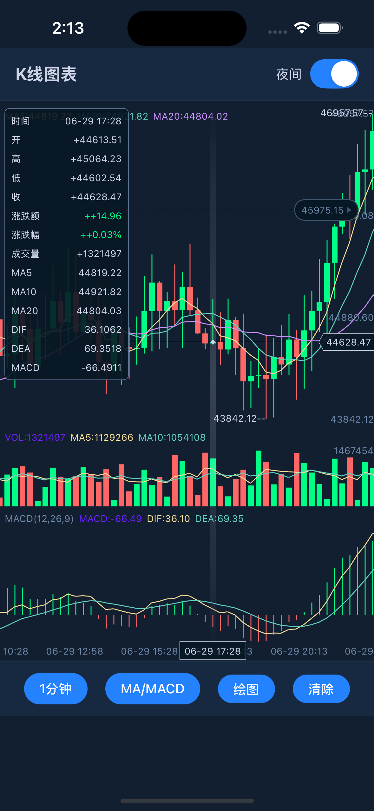
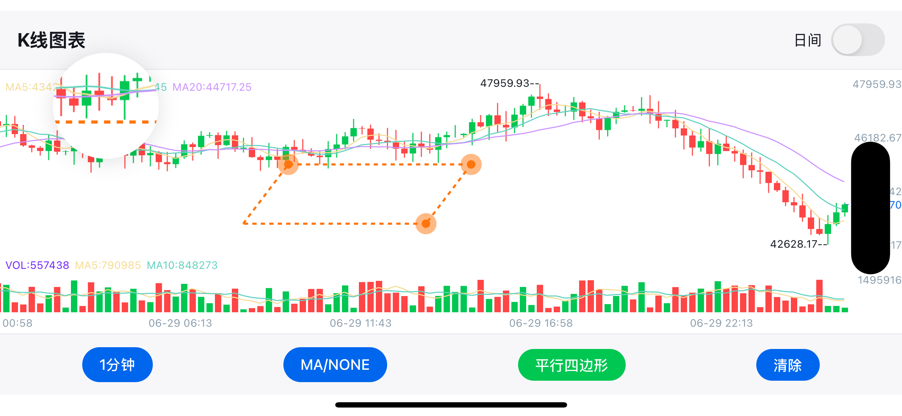

# Native KLine View

<div align="center">
  
</div>

**专业的 React Native / 原生 iOS & Android / Flutter K 线（蜡烛图）图表库**

_超流畅渲染 • 交互式绘图工具 • 多种技术指标 • 深色/浅色主题_

[English](./README.md) | 中文文档

[](https://www.apache.org/licenses/LICENSE-2.0)
[](https://reactnative.dev)

Native KLine View 是一个高性能、功能丰富的蜡烛图组件，专为专业交易类应用打造。基于 iOS 和 Android 原生实现，提供流畅的 60fps 滚动、缩放以及实时数据更新体验。

适用于加密货币交易所、股票交易应用、金融分析工具以及任何需要专业级行情展示的场景。

---

## 🌟 功能特性

### 📈 高级图表能力

- 超流畅滚动（原生性能优化，接近 60fps）
- 双指缩放（流畅手势识别）
- 长按查看详情（带动画信息面板）
- 实时数据更新（高效数据处理）
- 多时间周期支持（1m / 5m / 15m / 30m / 1h / 4h / 1d / 1w）

---

### 📊 技术指标

- 主图指标：MA（均线）、BOLL（布林带）
- 副图指标：MACD、KDJ、RSI、WR
- 支持自定义参数
- 多彩指标线 + 平滑动画
- 成交量分析图

---

### ✏️ 绘图工具

- 趋势线（支撑/阻力分析）
- 水平线（价格标记）
- 垂直线（时间标记）
- 矩形（区间标注）
- 文本标注
- 支持编辑与持久化

---

### 🎨 视觉效果

- 深色 / 浅色主题切换
- 渐变背景
- 全量自定义颜色
- 响应式布局（横竖屏）
- 高 DPI 渲染支持

---

### 📱 平台支持

- iOS & Android（原生实现）
- React Native 新架构支持（Fabric）
- Flutter 支持
- TypeScript 类型定义

---

## 🚀 性能演示

<div align="center">
  
  
  
  
</div>

---

## 📦 安装

### React Native（Git）

```bash
yarn add native-kline-view@https://github.com/hellohublot/native-kline-view.git
```

### React Native iOS 配置

```bash
cd ios && pod install
```

### React Native Android 配置

Android 无需额外配置。

## 🧩 Flutter（Git）

```yaml
dependencies:
  native_kline_view:
    git:
      url: https://github.com/hellohublot/native-kline-view.git
      path: flutter/native_kline_view
```

iOS:
说明：Flutter 插件依赖原生 Pod，请在你的 Flutter Podfile 里二选一：

本地路径（推荐，用于本仓库）：

```ruby
pod 'NativeKLineView', :path => '../../../ios'
```

或远程 podspec（无需本地 clone）：

```ruby
pod 'NativeKLineView', :podspec => 'https://raw.githubusercontent.com/hellohublot/native-kline-view/main/ios/NativeKLineView.podspec'
```

```dart
NativeKLineView(
  optionList: optionListJson,
  onDrawItemDidTouch: (payload) {},
  onDrawItemComplete: () {},
  onDrawPointComplete: (count) {},
)
```

## 🔌 原生 iOS

Podfile via Git:

```ruby
pod 'NativeKLineView', :podspec => 'https://raw.githubusercontent.com/hellohublot/native-kline-view/main/ios/NativeKLineView.podspec'
```

或使用本地 clone：

```ruby
pod 'NativeKLineView', :path => '../native-kline-view/ios'
```

## 🔌 原生 Android（无需 Maven 账号）

推荐：git submodule 或 clone 后，以 Gradle project 方式引用。

```bash
git submodule add https://github.com/hellohublot/native-kline-view.git
```

```gradle
// settings.gradle
include(":native-kline-view")
project(":native-kline-view").projectDir = new File(rootDir, "../native-kline-view/android")
```

```gradle
// app/build.gradle
implementation project(":native-kline-view")
```

XML 使用方式：

```xml
<com.github.fujianlian.klinechart.NativeKLineView
    android:id="@+id/klineView"
    android:layout_width="match_parent"
    android:layout_height="match_parent" />
```

## 🎯 快速开始

### 基础用法

查看完整的实现示例，请参考 **[example/App.js](./examples/react-native/App.js)**

示例应用展示了：

- 🎛️ **完整UI控件** - 时间周期选择器、指标切换器、绘图工具
- 🎨 **主题管理** - 深色/浅色模式平滑过渡
- 📊 **指标管理** - 动态指标切换和配置
- ✏️ **绘图工具** - 全功能绘图界面和工具选择
- 📱 **响应式设计** - 适配不同屏幕尺寸和方向

## 🆕 自定义成交标记组件

现在你可以通过 `tradeComponent` 使用自己的 React 组件渲染成交标记，而不是默认原生圆点。

<div align="center">
  

_示例：分时图中的自定义成交标记_

</div>

### 使用方式

```tsx
import React from "react";
import { View, Text } from "react-native";
import RNKLineView from "react-native-kline-view";

const TradeMarker = (trade: { type: "buy" | "sell" }, count: number) => (
  <View
    style={{
      backgroundColor: trade.type === "buy" ? "#11c766" : "#ff5b6e",
      borderRadius: 10,
      paddingHorizontal: 6,
      paddingVertical: 2,
    }}
  >
    <Text style={{ color: "#fff", fontSize: 10, fontWeight: "700" }}>
      {trade.type.toUpperCase()} {count}
    </Text>
  </View>
);

export default function Chart() {
  return (
    <RNKLineView
      optionList={JSON.stringify(optionList)}
      tradeComponent={TradeMarker}
    />
  );
}
```

## 📊 组件属性

### 核心属性

| 属性                  | 类型                          | 必需 | 默认值 | 描述                                                               |
| --------------------- | ----------------------------- | ---- | ------ | ------------------------------------------------------------------ |
| `optionList`          | string                        | ✅   | -      | 包含所有图表配置和数据的JSON字符串                                 |
| `tradeComponent`      | `(trade, count) => ReactNode` | ❌   | -      | 自定义成交标记渲染函数（`trade = { id, timestamp, price, type }`） |
| `onDrawItemDidTouch`  | function                      | ❌   | -      | 当绘图项目被触摸时的回调                                           |
| `onDrawItemComplete`  | function                      | ❌   | -      | 当绘图项目完成时的回调                                             |
| `onDrawPointComplete` | function                      | ❌   | -      | 当绘图点完成时的回调                                               |

### 事件回调详情

| 回调函数              | 参数                                                                                                 | 描述                                             |
| --------------------- | ---------------------------------------------------------------------------------------------------- | ------------------------------------------------ |
| `onDrawItemDidTouch`  | `{ shouldReloadDrawItemIndex, drawColor, drawLineHeight, drawDashWidth, drawDashSpace, drawIsLock }` | 用户触摸现有绘图项目时触发，返回绘图属性用于编辑 |
| `onDrawItemComplete`  | `{}`                                                                                                 | 用户完成创建新绘图项目时触发                     |
| `onDrawPointComplete` | `{ pointCount }`                                                                                     | 用户完成向绘图添加点时触发（对多点绘图有用）     |

## 🔧 OptionList 配置

`optionList` 是包含所有图表配置的JSON字符串。完整的结构如下：

### 主要配置

| 属性                | 类型    | 默认值 | 描述                          |
| ------------------- | ------- | ------ | ----------------------------- |
| `modelArray`        | Array   | `[]`   | K线数据数组（见下方数据格式） |
| `shouldScrollToEnd` | Boolean | `true` | 加载时是否滚动到最新数据      |
| `targetList`        | Object  | `{}`   | 技术指标参数                  |
| `configList`        | Object  | `{}`   | 视觉样式配置                  |
| `drawList`          | Object  | `{}`   | 绘图工具配置                  |

### 数据格式 (modelArray)

每个数据点应包含以下字段：

- `id`: 时间戳
- `open`: 开盘价
- `high`: 最高价
- `low`: 最低价
- `close`: 收盘价
- `vol`: 成交量
- `dateString`: 格式化时间字符串
- `selectedItemList`: 信息面板数据数组
- `maList`: 移动平均线数据（如果启用）
- `maVolumeList`: 成交量移动平均线数据
- 各种技术指标数据（MACD、KDJ、RSI等）

### 视觉配置 (configList)

| 属性                         | 类型   | 描述                                          |
| ---------------------------- | ------ | --------------------------------------------- |
| `colorList`                  | Object | `{ increaseColor, decreaseColor }` - 涨跌颜色 |
| `targetColorList`            | Array  | 指标线颜色数组                                |
| `backgroundColor`            | Color  | 图表背景色                                    |
| `textColor`                  | Color  | 全局文字颜色                                  |
| `gridColor`                  | Color  | 网格线颜色                                    |
| `candleTextColor`            | Color  | 蜡烛标签文字颜色                              |
| `minuteLineColor`            | Color  | 分时图线条颜色                                |
| `minuteGradientColorList`    | Array  | 分时图背景渐变色                              |
| `minuteGradientLocationList` | Array  | 渐变停止位置 [0, 0.3, 0.6, 1]                 |
| `mainFlex`                   | Number | 主图高度比例 (0.6 - 0.85)                     |
| `volumeFlex`                 | Number | 成交量图高度比例 (0.15 - 0.25)                |
| `paddingTop`                 | Number | 顶部内边距（像素）                            |
| `paddingBottom`              | Number | 底部内边距（像素）                            |
| `paddingRight`               | Number | 右侧内边距（像素）                            |
| `itemWidth`                  | Number | 每根蜡烛总宽度（包括边距）                    |
| `candleWidth`                | Number | 实际蜡烛体宽度                                |
| `fontFamily`                 | String | 所有文字的字体                                |
| `headerTextFontSize`         | Number | 标题文字大小                                  |
| `rightTextFontSize`          | Number | 右轴文字大小                                  |
| `candleTextFontSize`         | Number | 蜡烛数值文字大小                              |
| `panelTextFontSize`          | Number | 信息面板文字大小                              |
| `panelMinWidth`              | Number | 信息面板最小宽度                              |

### 绘图配置 (drawList)

| 属性                        | 类型    | 描述                                          |
| --------------------------- | ------- | --------------------------------------------- |
| `drawType`                  | Number  | 当前绘图工具类型 (0=无, 1=趋势线, 2=水平线等) |
| `shouldReloadDrawItemIndex` | Number  | 绘图状态管理                                  |
| `drawShouldContinue`        | Boolean | 完成一个项目后是否继续绘图                    |
| `shouldClearDraw`           | Boolean | 清除所有绘图的标志                            |
| `shouldFixDraw`             | Boolean | 完成当前绘图的标志                            |
| `shotBackgroundColor`       | Color   | 绘图覆盖层背景色                              |

### 技术指标配置 (targetList)

包含各种技术指标的参数设置：

**移动平均线设置**：

- `maList`: MA线配置数组
- `maVolumeList`: 成交量MA配置

**布林带参数**：

- `bollN`: 周期 (默认 "20")
- `bollP`: 标准差倍数 (默认 "2")

**MACD参数**：

- `macdS`: 快线EMA周期 (默认 "12")
- `macdL`: 慢线EMA周期 (默认 "26")
- `macdM`: 信号线周期 (默认 "9")

**KDJ参数**：

- `kdjN`: 周期 (默认 "9")
- `kdjM1`: K值平滑 (默认 "3")
- `kdjM2`: D值平滑 (默认 "3")

**RSI和WR设置**：

- `rsiList`: RSI配置数组
- `wrList`: WR配置数组

**查看完整配置示例，请参考 [example/App.js](./examples/react-native/App.js)**

## 📄 许可证

本项目基于 Apache License 2.0 许可证 - 查看 [LICENSE](./LICENSE) 文件了解详情。

## 🙏 致谢

本项目是对 [@tifezh](https://github.com/tifezh) 的原始 [KChartView](https://github.com/tifezh/KChartView) 的重大演进和增强。虽然受到原始Android专用库的启发，但这个React Native实现已经被完全重写，包含了许多额外功能：

### 相比原项目的主要增强

- ✅ **跨平台支持** - iOS 和 Android
- ✅ **React Native 集成** - 原生桥接实现
- ✅ **交互式绘图工具** - 完整的多工具绘图系统
- ✅ **高级主题** - 深色/浅色模式平滑切换
- ✅ **性能增强** - 优化为60fps滚动和缩放
- ✅ **现代UI组件** - 模态选择器和响应式设计
- ✅ **TypeScript 支持** - 完整类型定义
- ✅ **多时间框架** - 全面的时间周期支持
- ✅ **手势增强** - 高级触摸处理和绘图交互
- ✅ **实时更新** - 高效数据流和更新
- ✅ **专业指标** - 扩展的技术分析能力

代码库已完全重写以：

- 适配React Native的架构和桥接系统
- 使用Swift和Objective-C实现iOS支持
- 添加原版中不存在的综合绘图功能
- 提供现代化的专业交易界面
- 为移动设备优化性能
- 支持React Native的新旧架构

虽然我们尊重原项目的启发，但此实现代表了为现代React Native应用和专业交易界面优化的完全重新构想。

## 📞 支持

- 📧 **邮箱**: hellohublot@gmail.com
- 💬 **问题**: [GitHub Issues](https://github.com/hellohublot/react-native-kline-view/issues)
- 🎯 **示例**: 查看 [example/App.js](./examples/react-native/App.js) 获取全面的使用方法

---

<div align="center">
  <p><strong>为React Native社区用❤️构建</strong></p>
  <p>
    <a href="#-功能特性">功能特性</a> •
    <a href="#-安装">安装</a> •
    <a href="#-快速开始">快速开始</a> •
    <a href="#-组件属性">API</a> •
    <a href="#-许可证">许可证</a>
  </p>
</div>
